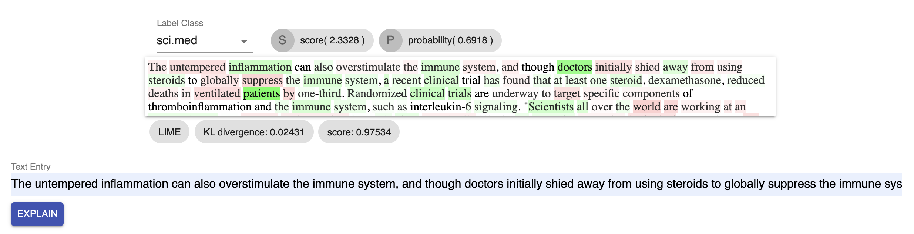
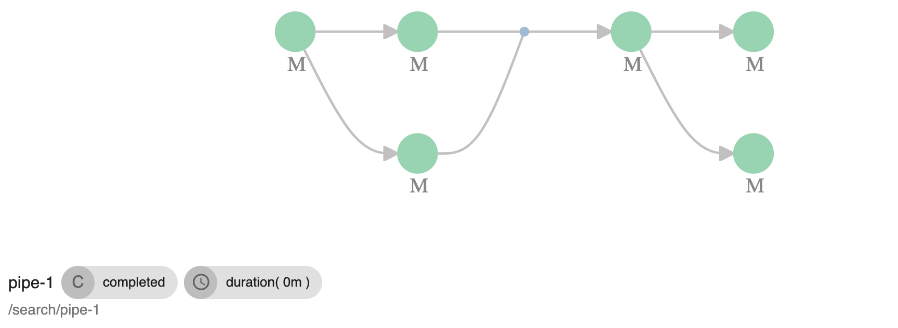
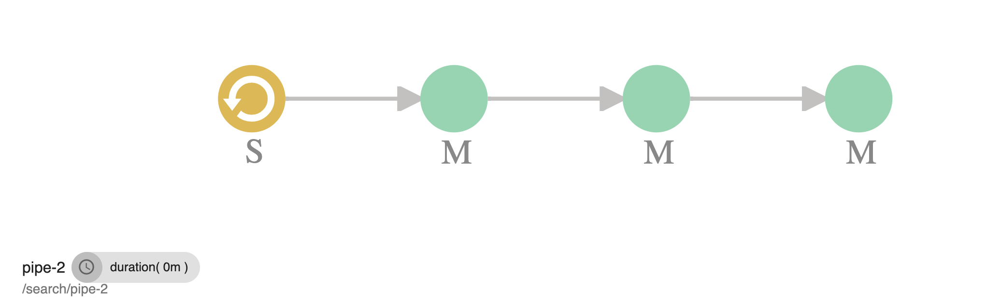

# Genome - Platform for Machine Learning Trust, Testing and Realtime Model Explanations/Introspection
Genome is a cloud native (K8) platform for ML model testing and explanations, geared towards production grade ML and AI pipelines that need to instill trust for different stakeholders. It comes with a suite of components that can be used in tandem or isolated to achieve testing/evaluations and realtime explanations of all model types via a structured representation of quality for AI. It is built on top of scalable technologies that lend themselves well to be operated at scale in the cloud.

# Table of Contents
1. [Vision](#vision)
2. [Genome Capabilities](#genomecapabilities)
3. [Components](#componentsandarchitecture)
4. [Model Store and Framework](#modelvisualizations)
4. [Evaluation Store and Framework](#evaluationstoreandframework-examples)
4. [Explaining Model Predictions](#explainingmodelpredictions-examples)
5. [Model Visualizations](#modelvisualizations)
6. [Sequencer - Chaining Compute Steps](#sequencer-chainingcomputesteps)
7. [Run Locally](#runlocally)
8. [Testing](#testing)

## Vision
Scalable Realtime ML Platform for _demystifying_, _dissecting_, _validating_ and _enhancing_ *trust* on increasingly complex production AI. We plan to achieve this via:

-  AI Services focused on *Realtime and Interactive Tests/Evaluations* for ML
-  AI Services focused on *Realtime and Interactive Explanations* of ML predictions
    -  on all types of data (tabular, image, text based)
-  Realtime Model and *Prediction Visualizations*
-  Framework and an Evaluation Store for reporting ML Tests/Evaluations
-  Framework and a Model Store for reporting ML models and supporting model cards
-  Production grade *Tracking and Versioning* ML Models, Pipelines and Deployments
-  Production grade *Tracking and Versioning* of Evaluations and Tests

#### Why Realtime?
Providing realtime tests and explanations for ML (models) is at the core of our vision. Why realtime plays a big role is because we want _auditors_ and stakeholders (yes, we believe ML should increasingly be audited and accessible for introspection to customers and other stakeholders, especially if it drives actions and decisions) along with ML engineers to be able to explain *new* data as it is available without waiting for the next batch job in several hours.

Considering that especially tests and explanations derived from model-agnostic/blackbox approaches are expensive, getting explanations *on-demand* and on a per need basis, in addition to supporting batch automated cases, for all training data, drops the cost and hence accessibility of model introspections and explanation in general for any particular prediction, which is critical and increasingly important. The current and future realtime capabilities of Genome are well positioned to service this need.


## Genome Capabilities
-  Store, Version, Search Models Evaluations and Pipelines with the Genome Model and Evaluation Stores
-  Store, Version and Search Evaluations and Tests via the Evaluation Store API-s and framework
-  Define model and ML pipelines with Compute and Sequencer
-  Explain in *realtime* predictions of any model type, in particular:
    -  predictions of models working on tabular data (linear, logistic, tree based, ensembles) via SHAP library
    -  image based models (CNN architectures) via GradCAM
    -  text based models operating on documents via LIME

-  Visualize model architecture and internals. Visualizations are a second leg to enabling interpretation, explanations, testing and trust. They can help clarify why models make certain decisions and are helpful for explainable model types, especially in the case of tree based models, to help interpret their decisions.
    -  trees, forests, ensembles (sklearn, XGBoost, Spark ML)
    -  linear, logistic model types


## Components:
-  Genome Model Store - API-s to store, version and track models
-  Genome Evaluation Store - API-s to store and track model tests and evaluations
-  Compute and Sequencer - API-s to create pipeline runs/schedules
-  Realtime Explainer - API-s to explain models from Model Store
-  Realtime Visualizer - API-s to visualize Models from Model Store
-  Routing - Routes to correct explainer or visualizer type
-  Auth - Auth[n|z] for external facing API-s
-  UI - UI for pipelines and models
-  Gateway


## Training Models and Explaining their Predictions in Realtime - Examples

### Explaining Models on Tabular Data
In this example we'll be creating and training a tree based model, specifically a random forest regressor that predicts on the CA housing dataset. Then the model will be stored in the Model Store to get realtime explanations.

```python

# other imports
from sklearn.ensemble import RandomForestClassifier
from sklearn.ensemble import RandomForestRegressor

# data
from sklearn.datasets import fetch_20newsgroups
from sklearn.datasets import fetch_california_housing


from .modelstore.client import ModelStore
from .modelstore.estimator import GenomeEstimator


# using the california housing dataset
dataset_train=fetch_california_housing()

# creating and fitting an sklearn random forest
forest_model = RandomForestRegressor(n_estimators=120,max_depth=5)
forest_model = forest_model.fit(dataset_train.data, dataset_train.target)


model_store = ModelStore()


# creating a genome model
# an explainer will be chosen based on modality and model type
genome_model = GenomeEstimator(forest_model,
      target_classes=["price"],
      feature_names=dataset_train.feature_names,
      modality="tabular")


# creating global model explanations via invoking sampleExplanations of the model
# for a representative data sample (sample sizes in the range of 1-3k work well)
data_to_explain = dataset_train.data[ np.random.choice( dataset_train.data.shape[0], 1200, replace=False), : ]

# generating and storing explanations in the genome model on a sample dataset
# a global view of model explanations is derived from the sample dataset
# the global model explanations are served in realtime via our realtime explainer  
genome_model.explainer.sampleExplanations(data_to_explain)


# save the genome model in model store
model_store.save_model(genome_model, {
    "canonicalName": canonicalName,
    "application": application_parameter or "search",
    "pipelineName": pipelinename_parameter or "pipeline-keras-test",
    "pipelineRunId": pipelinerun_parameter,
    "pipelineStage": stepname_parameter or "model",
    "framework": "sklearn",
    "inputModality": "tabular",
    "versionName": "1.2.3"
  })

```
To run this code first it needs to be built as a docker image, say with a name _housing-ca-forest-model_ and tag _local.1_ Then it can run via a call to our sequencer API-s as part of a one step pipeline. (See the Chaining Steps section):

```
POST http://127.0.0.1:8080/v1.0/genome/compute/sequencer/run
```

```javascript

{
    "pipelineName": "pipe-1",
    "canonicalName":"/housing/ca/forest-1",
    "application":"search",
    "steps": [{
    "stepName": "step-housing",
    "stepType": "model",
    "parameters":{
    },
    "datasets":[],
    // the image for model training
    // several env variables are reserved for passing dynamic information
    // like PIPELINE_RUNID, see below for full list
    "image": "housing-ca-forest-model:local.1",
    "timeout": "360s",
    "retry": "3"
  }]
}
```

After running this sequencer pipeline the trained model and the explainer will be available in the UI. We can than get realtime explanations via either the UI or programmatically via the API.

Explanations from UI - both the precomputed set from the example above and new explanations via a json entry can be obtained:


Explanations can be obtained via the API as well. The API will use the latest trained model with the specified canonicalName.
```
POST http://127.0.0.1:8080/v1.0/genome/routing/explain
```

```javascript
{
  "application": "your-app",
  "canonicalName": "model-canonical-name",
  // list of entries to explain, will be converted to a numpy array, or a panda dataframe in that sequence
  "entries": [
    [1,2.3,-0.243,...], //record 1
    [2.21,0.3,-0.443,...] //record 2 ...
  ]
}
```

RESPONSE:
```javascript
// RESPONSE:
{
  "expected": [2.0697080214631782], // base line prediction
  "number_labels": 1,
  "shapley": [  // shapley values for each feature of the records
    [2.385286622444727, -0.018421615109792185, -0.014984237058267673, -0.005339789397244816,…],
    [1.410856622444727, -0.016421615109792185, -0.044984237058267673, -0.005339789397244816,…]
  ]
}


```

### Explaining Models for Images
For models working on images we support explanations of classification use cases via GradCAM. Our basic assumption for models working on images is that they are using CNN architectures internally. While black box approaches would  also be possible (i.e. shapley values would be a candidate here as well), the restrictions associated with realtime explanations prevent us from going that route. We think focusing on the most widely used architectures for image classification is a reasonable way to remain within time budgets.

Again, the code to train our image classification model or even the code to use a popular pretrained model (VGG, ResNet50 etc.) needs to be provided and then built as a docker image. An example code below:

```python

#... other imports
from .modelstore.client import ModelStore
from .modelstore.estimator import GenomeEstimator


from tensorflow.keras.applications.mobilenet_v2 import MobileNetV2
from tensorflow.keras.applications.mobilenet_v2 import preprocess_input


canonicalName = "/classifier/mobilenet/v2"

# load keras pre-trained MobileNetV2 model
model = MobileNetV2(weights='imagenet', include_top=True)


genome = GenomeEstimator(model,
    data_preprocessor = preprocess_input, # function for preprocessing image input
    modality = "image")


model_store = ModelStore()

# save model to model store
model_store.save_model(genome, {
    "canonicalName": canonicalName,
    "application": "search",
    "pipelineName": "pipeline-keras-test",
    "pipelineRunId": "run-id", # or use the env variable to get the run id from the sequencer
    "pipelineStage": "image-class-step",
    "framework": "keras",
    "inputModality": "image", # note here the difference with the example with tabular data.
    "versionName": "test.1.2",
    "predictionType": "classification"
})

```  

Follow the same steps as in the tabular data example to build the image and then run a simple single-step pipeline to run the code. Then you should be able to see the model saved in the UI, ready to provide explanations on images (note the image dimensions for input images need to be the same that the model accepts):


The UI provides the predicted label and the probability (softmax layer) for the prediction. It highlights the areas important for that prediction. The first explanation takes a while (especially for large models) because the model is loaded on the fly from the model store and then subsequently cached

Similar to the tabular data example, the same can be achieved via the API:

```
POST http://127.0.0.1:8080/v1.0/genome/routing/explain
```

```javascript
{
  "application": "your-app",
  "canonicalName": "model-canonical-name",
  // your image needs to be base64 encoded and has to have the same size expected by the model
  "image": "your-image-base64-encoded"
}
```

RESPONSE:
```javascript
{
  "class": "rocket",
  "score": 0.41567, //softmax score
  "number_labels":1,
  "image": "explanation-image-base64-encoded-showing-important-areas..."
}
```

The base64 encoded image response can be directly attached in the _src_ attribute of an _img_ tag in html.


### Explaining Models for text
For models working on text we support explanations of classification via LIME. The intuition behind explanations on text models is that we train a surrogate (simpler explainable model) in realtime with generated synthetic data points _similar_ to the original input to be scored. The surrogate model then provides its weights for all the tokens or words to explain the original input, which is the real target of our explanation. An example would be to have a surrogate model be a simple linear model to approximate and explain a much more complex model (i.e transformer based) for a single data point.


The example below uses a text classification pipeline with a tokenization and tf/idf phase and a random forest classifier as the primary model/pipeline to train and classify on the 20_newsgroup dataset. After training the primary model it is passed to a genome estimator along with its prediction method and saved.


```python
#... other imports
from .modelstore.client import ModelStore
from .modelstore.estimator import GenomeEstimator


canonicalName = "/classifier/text/randomforest"

categories = ['alt.atheism', 'soc.religion.christian',
          'comp.graphics', 'sci.med']

twenty_train = fetch_20newsgroups(
  subset='train',
  categories=categories,
  shuffle=True,
  random_state=42,
  remove=('headers', 'footers'),
)


#text classification pipeline is composed out of tfid + LSA + a final random forest
vec = TfidfVectorizer(min_df=3, stop_words='english',
                  ngram_range=(1, 2))
svd = TruncatedSVD(n_components=100, n_iter=7, random_state=42)
lsa = make_pipeline(vec, svd)
forest_model = RandomForestClassifier(n_estimators=205,max_depth=5)
pipe = make_pipeline(lsa, forest_model)

# fit the primary text model
pipe.fit(twenty_train.data, twenty_train.target)


model_store = ModelStore()

model = GenomeEstimator(pipe, # passing the model to genome estimator
    estimator_predict = "predict_proba", # provide prediction function name of the pipeline/estimator to use for training the surrogate model
    target_classes = twenty_train.target_names,
    modality = "text")


# save genome estimator to model store
model_store.save_model(model, {
  "canonicalName": canonicalName,
  "application": "search",
  "pipelineName": "pipeline-text-test",
  "pipelineRunId": "run-1-text",
  "pipelineStage": "model",
  "framework": "sklearn",
  "inputModality": "text",
  "versionName": "sklearn-text.1.2.2",
  "predictionType": "classification"
})

```

The code above needs to be built into an image and run as a simple single-step pipeline via the sequencer API very similar to the other examples we have provided above for the tabular or image explanation use cases. After that the trained text model/pipeline will show up in our Model Store UI and the model detail page will contain a form for getting the explanation given a text input document like below:  




Getting explanations for text documents can also be performed programmatically via the explanation API similar to the tabular and image use cases:

```
POST http://127.0.0.1:8080/v1.0/genome/routing/explain
```

```javascript
{
  "application": "your-app",
  "canonicalName": "model-canonical-name",
  "text": "your text document as string..."
}
```

RESPONSE:
```javascript
{
  "metrics": {"score": 0.523, "mean_KL_divergence": 0.0232},
  "textExplanation": {
    "estimator": "SGDClassifier", // surrogate sklearn model used
    "method": "linear model",
    "targets": [ // each prediction class gets a target object with its score
      {
        "proba": 0.07,
        "score": -1.45,
        "target": "class-name-1",
        "weighted_spans": { // the words associated with their weight for this target's class
          "spans": [["the", [[0, 3]], -0.22912537016629908], [...], ...]
        }
      },
    ]
  }
}
```

Significant effort has gone into the visualizer implementation for text explanations to adjust it to a pure javascript/react version as opposed to its original lime/eli5 implementation so we recommend using that UI for visualizing the API results.


## Evaluation Store and Framework - Examples
Testing and evaluations are critical stages in the model development lifecycle. Genome treats tests and evaluations as first class citizens via its Evaluation Store. The Evaluation Store is the system of record for representing and tracking tests and evaluations in a structured way. To use the Evaluation Store create a test or evaluation class like in the example below, then run it with the trained model.


```python

import logging
from .modelstore.client import ModelStore
from .modelstore.estimator import GenomeEstimator
from .modelstore import evaluationstore
from .modelstore.evaluationspec import GenomeEvaluationRun, evaluation, task


# use the @evaluation annotation to declare a class as an evaluation
@evaluation(
  name="test/skill/annotations/better-than-last",
  versionName="1.2.sklearn",
  code = "ensemble-training:local.1",
  targetModel="target-id")
class TrainTestEvaluation(GenomeEvaluationRun):


    # use the @task annotation to declare a method as an evaluation task
    # task metadata for functions annotated this way, will be stored in
    # our Evaluation Store
    @task(dataset={"ref": "mllake://datasets/benchmark/california-housing-test"})
    def evaluateTrainTestSplit(self, t, dataset):
        my_split = 0.7

        t.add_metric("f2", 2.34)
        t.expect(my_split, var="my_split").toBeLess(0.76)

    # how to test for errors
    @task(dataset={"ref": "mllake://datasets/benchmark/california-housing-test"})
    def checkError(self, t, dataset):
        my_split = 0.7

        t.add_metric("f2", 2.34)
        t.expect(lambda: 5/0, var="myFunction").toRaise(ZeroDivisionError)


    # how to test for specific records in a dataset (named prototypes)
    # behaving in a certain way for a model
    @task(dataset={"ref": "mllake://datasets/benchmark/california-housing-test"})
    def prototypeTest(self, t, dataset):

        logging.info("running evaluation task:")
        logging.info(t)

        intersect = 0.82
        t.add_metric("intersection", intersect) \
          .expect(intersect, var="intersection") \
          .toBeGreater(0.52)

        # now some dummy prototypes
        for record in range(5):
            m = record * 1.24
            t.prototype(ref="id-123") \
              .add_metric("f1", record * 2.34) \
              .expect(m, var="f1") \
              .toBe([1,0], var="metric")


# now that the evaluation definition with its annotations is provided
# we can run the test either as part of the training stage, or separately

model_store = ModelStore()

canonicalName = modelMeta["canonicalName"]


categories = ['alt.atheism', 'soc.religion.christian',
          'comp.graphics', 'sci.med']

twenty_train = fetch_20newsgroups(
  subset='train',
  categories=categories,
  shuffle=True,
  random_state=42,
  remove=('headers', 'footers'),
)

#pipeline is composed out of tfid +LSA
vec = TfidfVectorizer(min_df=3, stop_words='english',
                  ngram_range=(1, 2))
svd = TruncatedSVD(n_components=100, n_iter=7, random_state=42)
lsa = make_pipeline(vec, svd)
forest_model = RandomForestClassifier(n_estimators=205,max_depth=5)

pipe = make_pipeline(lsa, forest_model)

# fit and score
pipe.fit(twenty_train.data, twenty_train.target)

model = GenomeEstimator(pipe,
    estimator_predict = "predict_proba",
    target_classes = twenty_train.target_names,
    modality = "text")


# save model
saved_model = model_store.save_model(model, {
  "canonicalName": canonicalName,
  "application": application_parameter or "search",
  "pipelineName": pipelinename_parameter or "pipeline-keras-test",
  "pipelineRunId": pipelinerun_parameter,
  "pipelineStage": stepname_parameter or "model",
  "framework": "sklearn",
  "inputModality": "text",
  "versionName": "sklearn-text.1.2.2",
  "predictionType": "classification"
})

# now finally run the evaluation defined in TrainTestEvaluation
# in target we are dynamically passing the trained model id from model store
split_eval = TrainTestEvaluation(None, target = saved_model["id"])
split_eval.to_run()


```

## Model Visualizations

To dissect and debug model decisions on tabular data we provide visualizations of linear, logistic and tree based models (including ensembles) for _sklearn_, _xgboost_ and _Spark ML_. Visualizing models internals, especially decision trees, can be helpful in understanding the path in the tree that the prediction took and dissecting the role of each feature value in the prediction, in addition to understanding distribution of the data points in the leaves. In the Model Store UI the model detail page provides a model visualizer. We do not have an API defined for this (yet).


The example below shows the first tree visualization of the random forest we trained in the tabular data example:


## Sequencer - Chaining Compute Steps
To have pipelines with multiple steps and place them on schedule use our pipeline solution, the Sequencer. The Sequencer is part of our compute platform and provides a declarative way via API-s to chain compute steps.

### Example Pipeline Run - sequence of steps:
This is an example of creating a pipeline run of a sequence of three modeling steps. Note the comments:
```
POST http://127.0.0.1:8080/v1.0/genome/compute/sequencer/run
```

```json

{
    "deployment": "deploy-1",
    "pipelineName": "pipe-1",
    "canonicalName":"/search/pipe-1",
    "application":"search",
    "steps": [{
    "stepName": "step-1",
    "stepType": "model",
    "parameters":{
      "CA_TRAIN": true
    },
    "datasets":[],
    "image": "ensemble-training:local.3",
    "timeout": "360s",
    "retry": "3"
  },{
    "stepName": "step-2",
    "stepType": "model",
    "parameters":{
      "TEXT_TRAIN": true
    },
    "datasets":[],
    "image": "ensemble-training:local.3",
    "timeout": "360s",
    "retry": "3"
  },{
    "stepName": "step-3",
    "stepType": "model",
    "parameters":{
      "IMAGE_TRAIN": true
    },
    "datasets":[],
    "image": "ensemble-training:local.3",
    "timeout": "360s",
    "retry": "3"
  }]
}

```

ENV variables passed to each step image/container:

-  DEPLOYMENT
-  DEPLOYMENT_PARAMETERS - (as json object)
-  APPLICATION
-  PIPELINE_RUNID
-  PIPELINE_NAME
-  STEP_NAME
-  STEP_TYPE
-  PARAMETERS - (as json object)
-  DATASETS - (as json list of dataRefs)


### Example Pipeline Run - sequence of parallel steps:
This is an example of creating a pipeline run of a sequence. The sequence contains a first step, then a set of 2 steps running in parallel, then a last step running after the preceding parallel steps complete:

```
POST http://127.0.0.1:8080/v1.0/genome/compute/sequencer/run
```

```json

{
    "deployment": "deploy-1",
    "pipelineName": "pipe-1",
    "canonicalName":"/search/pipe-1",
    "application":"search",
    "steps": [{
    "stepName": "step-1",
    "stepType": "model",
    "parameters":{
      "CA_TRAIN": true
    },
    "datasets":[],
    "image": "ensemble-training:local.3",
    "timeout": "360s",
    "retry": "3"
  },[{
    "stepName": "step-2a",
    "stepType": "model",
    "parameters":{
      "TEXT_TRAIN_1": true
    },
    "datasets":[],
    "image": "ensemble-training:local.3",
    "timeout": "360s",
    "retry": "3"
  },{
    "stepName": "step-2b",
    "stepType": "model",
    "parameters":{
      "TEXT_TRAIN_2": true
    },
    "datasets":[],
    "image": "ensemble-training:local.3",
    "timeout": "360s",
    "retry": "3"
  }],{
    "stepName": "step-3",
    "stepType": "model",
    "parameters":{
      "IMAGE_TRAIN": true
    },
    "datasets":[],
    "image": "ensemble-training:local.3",
    "timeout": "360s",
    "retry": "3"
  }]
}

```


Sequencer pipelines and pipeline runs can be viewed in the UI:




### Example Pipeline with Schedule:
This is an example API of creating a pipeline that runs every 6h. It's scheduling a sequence of 3 steps, same as in the first example. The very first schedule is not run immediately but only after the first period defined in the API elapses:

```
POST http://127.0.0.1:8080/v1.0/genome/compute/sequencer
```

```json

{
    "deployment": "deploy-1",
    "pipelineName": "pipe-1",
    "canonicalName":"/search/pipe-1",
    "application":"search",
    "schedule": "6h",
    "steps": [{
    "stepName": "step-1",
    "stepType": "model",
    "parameters":{
      "CA_TRAIN": true
    },
    "datasets":[],
    "image": "ensemble-training:local.3",
    "timeout": "360s",
    "retry": "3"
  },{
    "stepName": "step-2",
    "stepType": "model",
    "parameters":{
      "TEXT_TRAIN": true
    },
    "datasets":[],
    "image": "ensemble-training:local.3",
    "timeout": "360s",
    "retry": "3"
  },{
    "stepName": "step-3",
    "stepType": "model",
    "parameters":{
      "IMAGE_TRAIN": true
    },
    "datasets":[],
    "image": "ensemble-training:local.3",
    "timeout": "360s",
    "retry": "3"
  }]
}

```
*Sequencer Scheduled Pipeline*  



## Run Locally

### Install Docker
Follow instructions on Docker site

### Install Minikube (Local Kubernetes)
For MacOS run
```
brew install minikube
```
otherwise follow instructions at minikube site: https://minikube.sigs.k8s.io/docs/start/


### Install Terraform
Follow instructions at terraform site: https://learn.hashicorp.com/tutorials/terraform/install-cli

### Build Component Images
to build the genome service images run
```
./build-images.sh
```

To have a few example working models run:
```
./build-example-image.sh
```
This will create images for the model code in the example folder. A *pipeline run* needs to be created via a call to the sequencer API, like described in the Sequencer section, for the model code to actually execute and a few models to be stored in the Genome model store.

### Running
First do a terraform apply
```
cd terraform/local-test
terraform apply
```

After this the services will be running in minikube. The last step is to port-forward the nginx gateway in minikube to localhost:
```
 kubectl -n local port-forward service/genome-a-nginx-service 8080
```

*Note:* The Genome services will be running in the namespace _local_

Now all services are reachable. Go to the below address in the browser:
```
http://127.0.0.1:8080/static/index.html
```


## Testing
To run tests for our components start:
```
./test-images.sh
```
To run tests only for specific components disable undesired components in the script above.

## Built with
-  SHAP
-  LIME
-  React
-  NodeJS
-  ElasticSearch
-  K8

Our visualizations borrow heavily from the dtreeviz project, but with significant changes in stack and serving philosophy.
