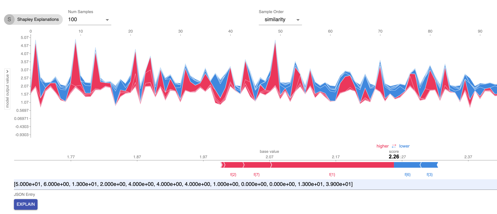
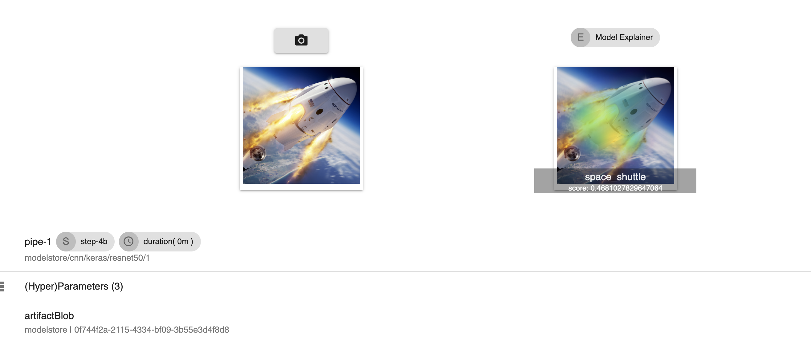
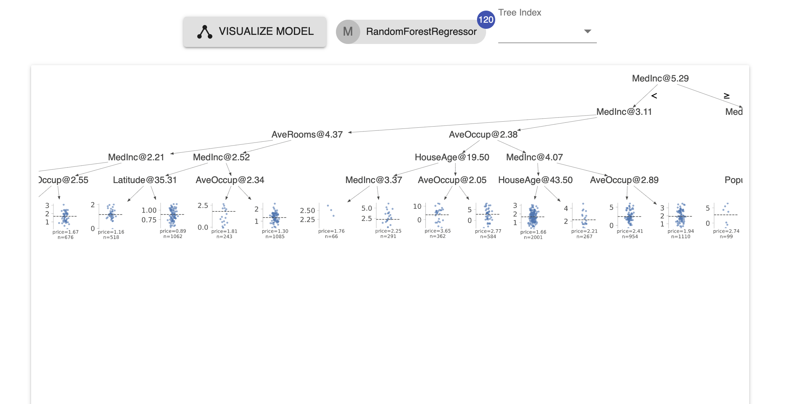
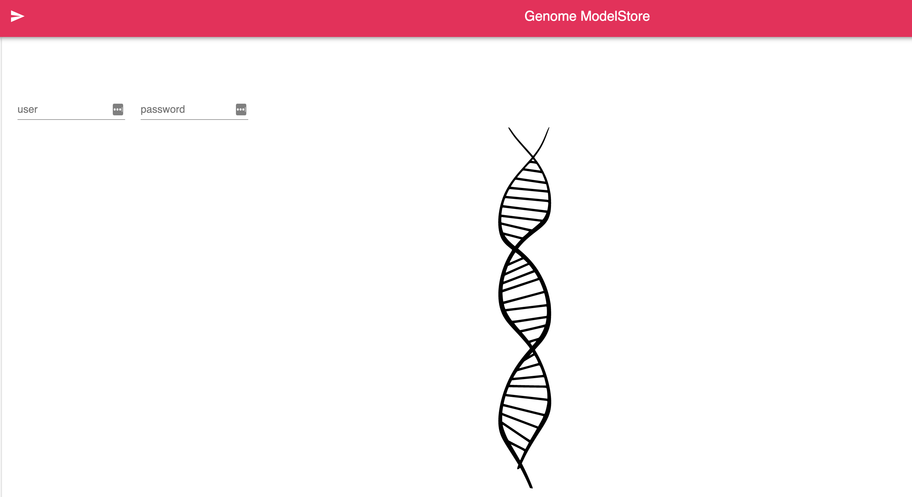

# Genome - Platform for Realtime ML Model Explanations and Inspection
Genome is a cloud native (K8) platform for model explanations and tests, geared towards production grade ML and AI pipelines. It comes with a suite of components that can be used in tandem or isolated to achieve realtime explanations of all model types. It is built on top of scalable technologies that lend themselves well to be operated at large scale in the cloud.

## Vision
Scalable ML Platform for demystifying, dissecting, validating and trusting increasingly complex production AI. We plan to achieve this via:

-  Scalable Realtime Explanations of ML Models
    -  on all types of data (image, text based, tabular)
-  Production grade Tracking and Versioning ML Models and Pipelines
-  Robust test pipelines and flagging of problematic models

## Genome Capabilities
-  Store, Version, Search Models with Model Store
-  Define model and data pipelines with Compute and Sequencer
-  Explain in realtime predictions of any model type, in particular:
    -  predictions of models working on tabular data (linear, logistic, tree based, ensembles) via SHAP library
    -  image based models (CNN architectures) via GradCAM
    -  text based models operating on documents via LIME

-  visualize model internals
    -  linear, logistic model types
    -  trees, forests, ensembles (sklearn, XGBoost, Spark ML)


## Components and Architecture:
-  Genome Model Store - API-s to store and track models
-  Compute and Sequencer - API-s to create pipeline runs/schedules
-  Realtime Explainer - API-s to explain models from Model Store
-  Realtime Visualizer - API-s to visualize Models from Model Store
-  Routing - Routes to correct explainer or visualizer
-  Auth - Auth[n|z] for external facing API-s
-  UI - UI for pipelines and models
-  Gateway


## Examples
#### Explaining Models on tabular data
In this example we'll be creating and training a tree based model, specifically a random forest regressor that predicts on the CA housing dataset. Then the model will be stored in the model store to get realtime explanations out of it.

```python
# using the california housing dataset
dataset_train=fetch_california_housing()

# creating and fitting an sklearn random forest
forest_model = RandomForestRegressor(n_estimators=120,max_depth=5)
forest_model = forest_model.fit(dataset_train.data, dataset_train.target)

# creating the explainer, a shap tree explainer
explainer = shap.TreeExplainer(forest_model)

# creating a genome model with the explainer and with sample explanations
# the explanations parameter captures a sample set of precalculated shapley explanations to store and display along with the model
genome_model = GenomeEstimator(forest_model,
      target_classes=["price"],
      feature_names=dataset_train.feature_names,
      explainer=explainer, # the explinaer we created before
      explanations={
          "expected_value": expected_value,
          "shap_values": shap_values,
          "number_labels": number_labels
      })

# save the genome model in model store
modelStore.saveModel(genome_model, {
    "canonicalName": canonicalName,
    "application": application_parameter or "search",
    "pipelineName": pipelinename_parameter or "pipeline-keras-test",
    "pipelineRunId": pipelinerun_parameter,
    "pipelineStage": stepname_parameter or "model",
    "framework": "sklearn",
    "inputModality": "tabular",
    "versionName": "1.2.3"
  })

```
To run this code first it needs to be built as a docker image, say with a name _housing-ca-forest-model_ and tag _local.1_ Then it can run via a call to our sequencer API-s as part of a one step pipeline. (See the Chaining Steps section):

```
POST http://127.0.0.1:8080/v1.0/genome/compute/sequence/run
```

```javascript

{
    "pipelineName": "pipe-1",
    "canonicalName":"/housing/ca/forest-1",
    "application":"search",
    "steps": [{
    "stepName": "step-housing",
    "stepType": "model",
    "parameters":{
    },
    "datasets":[],
    // the image for model training
    // several env variables are reserved for passing dynamic information
    // like PIPELINE_RUNID, see below for full list
    "image": "housing-ca-forest-model:local.1",
    "timeout": "360s",
    "retry": "3"
  }]
}
```

After running this sequencer pipeline the trained model and the explainer will be available in the UI. We can than get realtime explanations via wither the UI or programmatically via the API.

Explanations from UI - both the precomputed set from the example above and new explanations via a json entry can be obtained:



Explanations can be obtained via the API as well. The API will use the latest trained model with the specified canonicalName.
```
POST http://127.0.0.1:8080/v1.0/genome/routing/explain
```

```javascript
{
  "application": "your-app",
  "canonicalName": "model-canonical-name",
  // list of entries to explain, will be converted to a numpy array, or a panda dataframe in that sequence
  "entries": [
    [1,2.3,-0.243,...], //record 1
    [2.21,0.3,-0.443,...] //record 2 ...
  ]
}
```

RESPONSE:
```javascript
// RESPONSE:
{
  "expected": [2.0697080214631782], // base line prediction
  "number_labels": 1,
  "shapley": [  // shapley values for each feature of the records
    [2.385286622444727, -0.018421615109792185, -0.014984237058267673, -0.005339789397244816,…],
    [1.410856622444727, -0.016421615109792185, -0.044984237058267673, -0.005339789397244816,…]
  ]
}


```

#### Explaining Models for Images
For models working on images we support explanations of classification use cases via GradCAM. Our basic assumption for models working on images is that they are using CNN architectures internally. While black box approaches would  also be possible (i.e. shapley values would be a candidate here as well), the restrictions associated with realtime explanations prevent us from going that route. We think focusing on the most widely used architectures for image classification is a reasonable way to go to remain within time budgets.

Again, the code to train our image classification model or even the code to use a popular pretrained model (VGG, ResNet50 etc.) needs to be provided and then built as a docker image. An example code below:

```python
canonicalName = "/classifier/mobilenet/v2"

# load keras pre-trained MobileNetV2 model
model = MobileNetV2(weights='imagenet', include_top=True)

# save model to model store
modelStore.saveModel(model, {
    "canonicalName": canonicalName,
    "application": "search",
    "pipelineName": "pipeline-keras-test",
    "pipelineRunId": "run-id", //or use the env variable to get the run id from the sequencer
    "pipelineStage": "image-class-step",
    "framework": "keras",
    "inputModality": "image", // note here the ddifference with the example with tabular data.
    "versionName": "test.1.2",
    "predictionType": "classification"
})

```  

Follow the same steps as in the tabular data example to build the image and then run a simple single-step pipeline to run the code. Then you should be able to see the model saved in the UI, ready to provide explanations on images (note the image dimensions for input images need to be the same that the model accepts):




The UI provides the predicted label and the probability (softmax layer) for the prediction. It highlights the areas important for that prediction. The first explanation takes a while (especially for large models) because the model is loaded on the fly from the model store and then subsequently cached

Similar to the tabular data example, the same can be achieved via the API:

```
POST http://127.0.0.1:8080/v1.0/genome/routing/explain
```

```javascript
{
  "application": "your-app",
  "canonicalName": "model-canonical-name",
  // your image needs to be base64 encoded and has to have the same size expected by the model
  "image": "your-image-base64-encoded"
}
```

RESPONSE:
```javascript
{
  "class": "rocket",
  "score": 0.41567, //softmax score
  "number_labels":1,
  "image": "explanation-image-base64-encoded-showing-important-areas..."
}
```

The base64 encoded image response can be directly attached in the _src_ attribute of an _img_ tag in html.

#### Models on text and explanation
TODO


### Model Visualizations

To disect and debug model decisions on tabular data we provide visualizations of linear, logistic and tree based models (or ensembles) for _sklearn_ and _xgboost_. Visualizing models internals, especially decision trees, can be helpful in understanding the path in the tree that the prediction took and dissecting the role of each feature value in the prediction, in addition to understanding distribution of the data points in the leaves. In the Model Store UI the model detail page provides a model visualizer. We do not have an API defined for this (yet).


The example below shows the first tree visualization of the random forest we trained in the tabular data example:




## Sequencer - Chaining Compute Steps
To have pipelines with multiple steps and place them on schedule use our pipeline solution, the Sequencer. The Sequencer is part of our compute platform and provides a declarative way via API-s to chain compute steps.

#### Example Pipeline Run - sequence of steps:
This is an example of creating a pipeline run of a sequence of three modeling steps. Note the comments:
```
POST http://127.0.0.1:8080/v1.0/genome/compute/sequence/run
```

```javascript

{
    "pipelineName": "pipe-1",
    "canonicalName":"/search/pipe-1",
    "application":"search",
    "steps": [{
    "stepName": "step-1",
    "stepType": "model",
    "parameters":{
      "CA_TRAIN": true
    },
    "datasets":[],
    // the image for model training
    // several env variables are reserved for passing dynamic information
    // like PIPELINE_RUNID, see below for full list
    "image": "ensemble-training:local.3",
    "timeout": "360s",
    "retry": "3"
  },{
    "stepName": "step-2",
    "stepType": "model",
    // set of user defined parameters propagated to the modeling image
    // in the modeling image these parameters are available as an env variable
    // under PARAMETERS
    "parameters":{
      "TEXT_TRAIN": true
    },
    "datasets":[],
    "image": "ensemble-training:local.3",
    "timeout": "360s",
    "retry": "3"
  },{
    "stepName": "step-3",
    "stepType": "model",
    "parameters":{
      "IMAGE_TRAIN": true
    },
    "datasets":[],
    "image": "ensemble-training:local.3",
    "timeout": "360s",
    "retry": "3"
  }]
}

```

ENV variables passed to each step image/container:

-  APPLICATION
-  PIPELINE_RUNID
-  PIPELINE_NAME
-  STEP_NAME
-  STEP_TYPE
-  PARAMETERS
-  DATASETS


#### Example Pipeline Run - sequence of parallel steps:
This is an example of creating a pipeline run of a sequence. The sequence contains a first step, then a set of 2 steps running in parallel, then a last step running after the preceding parallel steps complete:

```
POST http://127.0.0.1:8080/v1.0/genome/compute/sequence/run
```

```json

{
    "pipelineName": "pipe-1",
    "canonicalName":"/search/pipe-1",
    "application":"search",
    "steps": [{
    "stepName": "step-1",
    "stepType": "model",
    "parameters":{
      "CA_TRAIN": true
    },
    "datasets":[],
    "image": "ensemble-training:local.3",
    "timeout": "360s",
    "retry": "3"
  },[{
    "stepName": "step-2a",
    "stepType": "model",
    "parameters":{
      "TEXT_TRAIN_1": true
    },
    "datasets":[],
    "image": "ensemble-training:local.3",
    "timeout": "360s",
    "retry": "3"
  },{
    "stepName": "step-2b",
    "stepType": "model",
    "parameters":{
      "TEXT_TRAIN_2": true
    },
    "datasets":[],
    "image": "ensemble-training:local.3",
    "timeout": "360s",
    "retry": "3"
  }],{
    "stepName": "step-3",
    "stepType": "model",
    "parameters":{
      "IMAGE_TRAIN": true
    },
    "datasets":[],
    "image": "ensemble-training:local.3",
    "timeout": "360s",
    "retry": "3"
  }]
}

```


#### Example Pipeline with Schedule:
This is an example API of creating a pipeline that runs every 6h. Its scheduling a sequence of 3 steps, same as in the first example. The very first schedule is not run immediately but only after the period defined in the API elapses:

```
POST http://127.0.0.1:8080/v1.0/genome/compute/sequence
```

```json

{
    "pipelineName": "pipe-1",
    "canonicalName":"/search/pipe-1",
    "application":"search",
    "schedule": "6h",
    "steps": [{
    "stepName": "step-1",
    "stepType": "model",
    "parameters":{
      "CA_TRAIN": true
    },
    "datasets":[],
    "image": "ensemble-training:local.3",
    "timeout": "360s",
    "retry": "3"
  },{
    "stepName": "step-2",
    "stepType": "model",
    "parameters":{
      "TEXT_TRAIN": true
    },
    "datasets":[],
    "image": "ensemble-training:local.3",
    "timeout": "360s",
    "retry": "3"
  },{
    "stepName": "step-3",
    "stepType": "model",
    "parameters":{
      "IMAGE_TRAIN": true
    },
    "datasets":[],
    "image": "ensemble-training:local.3",
    "timeout": "360s",
    "retry": "3"
  }]
}

```


## Run Locally:

#### Install Docker
Follow instructions on Docker site

#### Install Minikube (Local Kubernetes)
For MacOS run
```
brew install minikube
```
otherwise follow instructions at minikube site: https://minikube.sigs.k8s.io/docs/start/


#### Install Terraform
Follow instructions at terraform site: https://learn.hashicorp.com/tutorials/terraform/install-cli

#### Build Component Images
to build the genome service images run
```
./build-images.sh
```

To have a few example working models run:
```
./build-example-image.sh
```
This will create images for the example folder

#### Running
First do a terraform apply
```
cd terraform/local-test
terraform apply
```

After this the services will be running in minikube. The last step is to port-forward the nginx gateway in minikube to localhost:
```
 kubectl -n local port-forward service/genome-a-nginx-service 8080
```

*Note:* The Genome services will be running in the namespace _local_

Now all services are reachable. Go to the below address in the browser:
```
http://127.0.0.1:8080/static/index.html
```




## Testing:
To run tests for our components start:
```
./test-images.sh
```
To run tests only for specific components disable undesired components in the script above.
